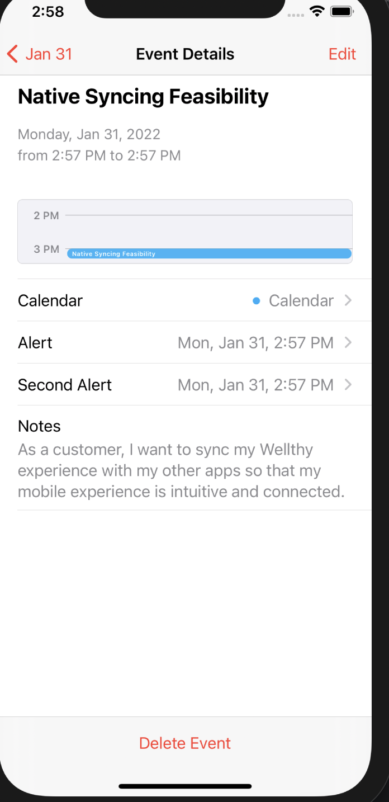

This is an overview of the possibilities around native app syncing feasibility with react native calendar app

## Getting Started

```bash

git clone https://github.com/Bluebird2000/NativeCalendarSyncing.git

npm i

cd ios && pod install

Run the app on simulator using `npm run ios`

```

## Testing the Proof of concept

- Ensure you `allow calendar event` once it pop on your screen after successfully running the app, this is only required once.
- once the app app has been successfully setup, you'd see a form input for a simple task creation which takes in title and note payload, ensure the two entries are filled.
- Click the submit to sync to the device native calendar app.

## Screenshot from the proof of concept



